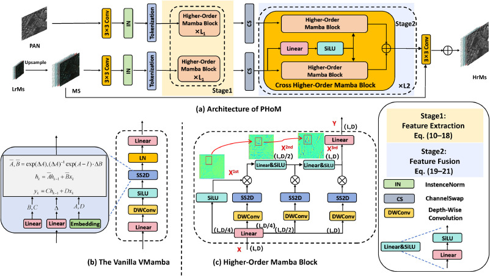

# PHoM: Effective pan-sharpening via higher-order state-space model

Official implementation of **PHoM: Effective pan-sharpening via higher-order state-space model**.

🚧 **Published** 🚧
PHoM paper:
https://doi.org/10.1016/j.neunet.2026.108616


## Overview
This repository will provide the code and pretrained models for our pan-sharpening method based on a higher-order state-space model (PHoM).

## Abstract
Pan-sharpening is intended to generate high-resolution multi-spectral images, utilizing pairs of low-resolution multi-spectral and high-resolution panchromatic images. Recently, the Mamba-based pan-sharpening models achieve state-of-the-art performance due to their efficient long-range relational modeling. However, Mamba inherently obeys a first-order state-space high-dimensional nonlinear mapping, which fails to efficiently encode higher-order expressive interactions of spectral features. In this study, we propose a novel higher-order state-space model for pan-sharpening (PHoM). Our PHoM follows the concept of splitting, interaction, and aggregation for higher-order spatial adaptive interaction and discriminative learning without introducing excessive computational overhead. To model the fusion process between multi-spectral and panchromatic images, we further extend the PHoM into a cross-modal PHoM, which further improves the representation capability by exploiting higher-order cross-modal correlations. We conduct extensive experiments on different datasets. Experimental results show that our method achieves significant performance improvements, outperforming previous state-of-the-art methods on public datasets.


## Framework

<p align="center">
  
</p>
*Figure 1. The overall architecture of PHoM.*

## Status
The code and models have currently been released.

## Quick Start

1. Clone the repository:

```
git clone https://github.com/PenglianGao/PHoM.git
```
2. Explore the pan-sharpening folder for remote sensing applications or the mamba block folder for module integration.

3. Follow the guidelines provided in the respective folders to apply PHoM to your specific use case.

For installation issues related to Mamba, please refer to the ViM and VMamba repositories, where more detailed instructions and extensive engineering-related Q&A can be found.

## Citation
If you find this work useful, please consider citing our paper.
```bibtex
@article{gao2026phom,
  title={PHoM: Effective Pan-Sharpening via Higher-Order State-Space Model},
  author={Gao, Penglian and Ge, Hongwei and Su, Shuzhi},
  journal={Neural Networks},
  pages={108616},
  year={2026},
  publisher={Elsevier}
}
``` 
Please also consider citing Pan-Mamba if you use this repository.
## Acknowledgment

We sincerely thank the authors of *Pan-Mamba: Effective Pan-Sharpening with State Space Model* for their inspiring work and for making their code publicly available, which provided a valuable foundation for our research.

Pan-Mamba repository:
https://github.com/alexhe101/Pan-Mamba

Pan-Mamba paper:
https://arxiv.org/abs/2402.12192

## Contact
For questions or collaboration, feel free to open an issue.

Email: 840791801@qq.com
---

